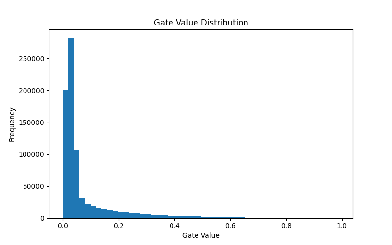
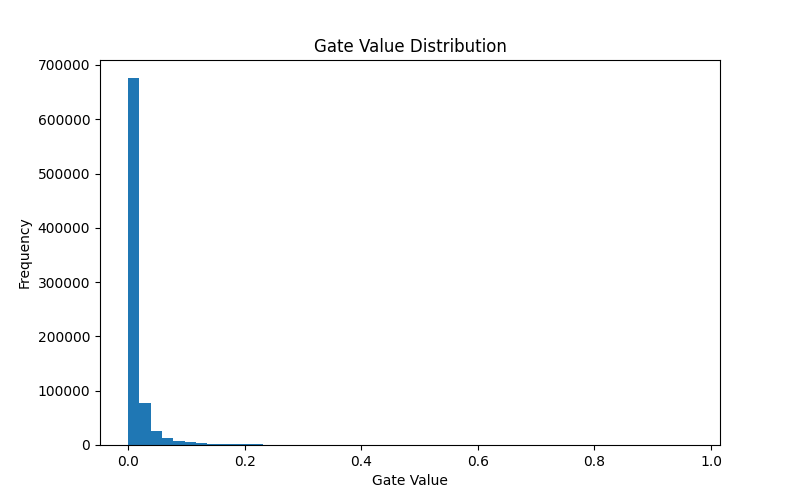
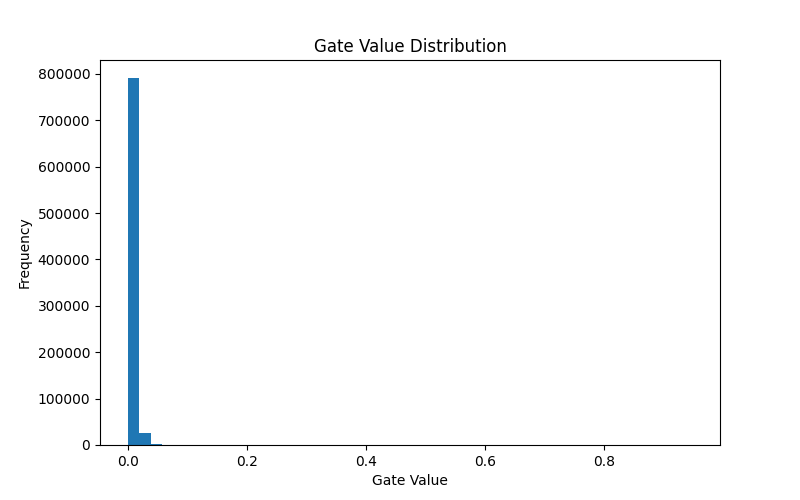
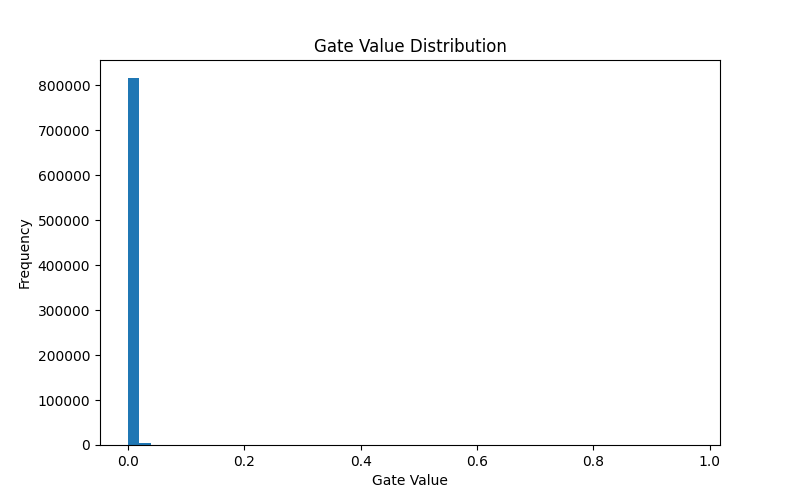

# Self-Pruning Neural Network (Tredence AI Engineer Case Study)

## Overview
This project implements a self-pruning neural network where each weight is controlled by a learnable gate. The network dynamically learns which connections are important and removes unnecessary ones during training.

The goal is to demonstrate:
- Dynamic model pruning
- Sparsity vs accuracy trade-off
- Custom neural layer design

---

## Key Idea
Each weight is paired with a learnable parameter such that:
gate = sigmoid(gate_score)

The effective weight becomes:
pruned_weight = weight × gate

If gate → 0 → connection is pruned  
If gate → 1 → connection is retained  

---

## Architecture
- Input: 32×32×3 (CIFAR-10)
- Fully Connected Network:
  3072 → 256 → 128 → 10
- Activation: ReLU
- Custom Layer: PrunableLinear

---

## Loss Function
Total Loss = CrossEntropyLoss + λ × SparsityLoss

Where:
- SparsityLoss = sum of all gate values
- λ controls pruning strength

---

## Why L1 Regularization Works
L1 regularization penalizes non-zero values linearly, pushing many gate values toward exactly zero. This results in a sparse network where only the most important connections remain active.

---

## Final Results

| Lambda | Epochs | Accuracy (%) | Sparsity (%) |
|--------|--------|--------------|---------------|
| 1e-5   | 7      | 47.20        | 6.00          |
| 1e-4   | 10     | 47.25        | 46.96         |
| 1e-3   | 10     | 43.45        | 57.90         |

---

## Observations

- Increasing λ increases sparsity.
- Increasing λ slightly reduces accuracy.
- Moderate λ (1e-4) provides the best balance between accuracy and sparsity.
- High λ (1e-3) results in stronger pruning but some loss in performance.
- Low λ (1e-5) leads to almost no pruning.

---

## Gate Distribution Analysis

### λ = 1e-5 (Minimal Pruning)

Gates remain spread across values, indicating minimal pruning and most connections staying active.

### λ = 1e-4 (Balanced Pruning)

Strong spike near zero with some active gates remaining, showing optimal trade-off.

### λ = 1e-3 (Aggressive Pruning)

Majority of gates shift toward zero, indicating strong pruning behavior.

---

## Implementation Details
- Framework: PyTorch
- Dataset: CIFAR-10
- Optimizer: Adam
- Device: GPU (Google Colab)

---

## Challenges Faced

- **Loss scaling issue**:  
  Sparsity loss using sum can dominate training if λ is not tuned properly.

- **Normalization attempt**:  
  Using mean reduced sparsity impact too much, so sum-based formulation was retained.

- **Training instability**:  
  High λ values required more epochs to effectively push gates toward zero.

- **Epoch sensitivity**:  
  Different λ values required different training durations to reach stable behavior.

- **Over-pruning issue**:  
  Longer training caused even small λ values to accumulate pruning effects, leading to unintended sparsity.

- **Notebook state issues**:  
  Results were inconsistent when the model was not reset between runs.

---

## Key Learnings

- Sparsity is controlled by both λ and training duration.
- Larger λ values increase pruning pressure but require sufficient training time.
- Smaller λ values converge faster but may not produce meaningful sparsity.
- Training duration must be carefully controlled to avoid unintended pruning.
- There is a clear trade-off between model compression and performance.
- Practical ML systems require balancing multiple objectives, not just optimizing a single metric.

---

## Important Insight

We observed that sparsity is influenced not only by λ but also by the number of training epochs.  
Longer training allows even weak sparsity penalties to accumulate and push gates toward zero.

Therefore, epochs were adjusted (6–10) to ensure each configuration reached stable and meaningful behavior.

---

## How to Run
pip install -r requirements.txt

Then:
- Open self_pruning_model.ipynb
- Run all cells sequentially

---

## Project Structure
```
self-pruning-network/
│
├── self_pruning_model.ipynb
├── README.md
├── requirements.txt
│
├── results/
│   ├── gate_distribution1e3.png
│   ├── gate_distribution1e4.png
│   ├── gate_distribution1e5.png
|   ├── sparsity_vs_epochs.png
```
---

## Conclusion
This project demonstrates that neural networks can learn to prune themselves dynamically using learnable gates and L1 regularization.

A balance between sparsity and accuracy can be achieved by tuning λ and training duration.  
The approach enables significant model compression while maintaining reasonable performance.

---

# Additional Insights
As an additional experiment, we extended training for higher sparsity configurations.

For λ = 1e-3 at 15 epochs, the model achieved approximately 97.98% sparsity, demonstrating that extended training can further amplify pruning effects.

This indicates that while λ controls sparsity strength, training duration also plays a significant role in pushing gate values toward zero.

However, for fair comparison across different λ values, the main results are reported using controlled epoch settings.

---

## 📈 Sparsity vs Epochs (λ = 1e-3)



This plot shows how sparsity increases with training duration, reinforcing that longer training amplifies pruning effects.

---

## 🙌 Author
Developed as part of Tredence AI Engineer Case Study.